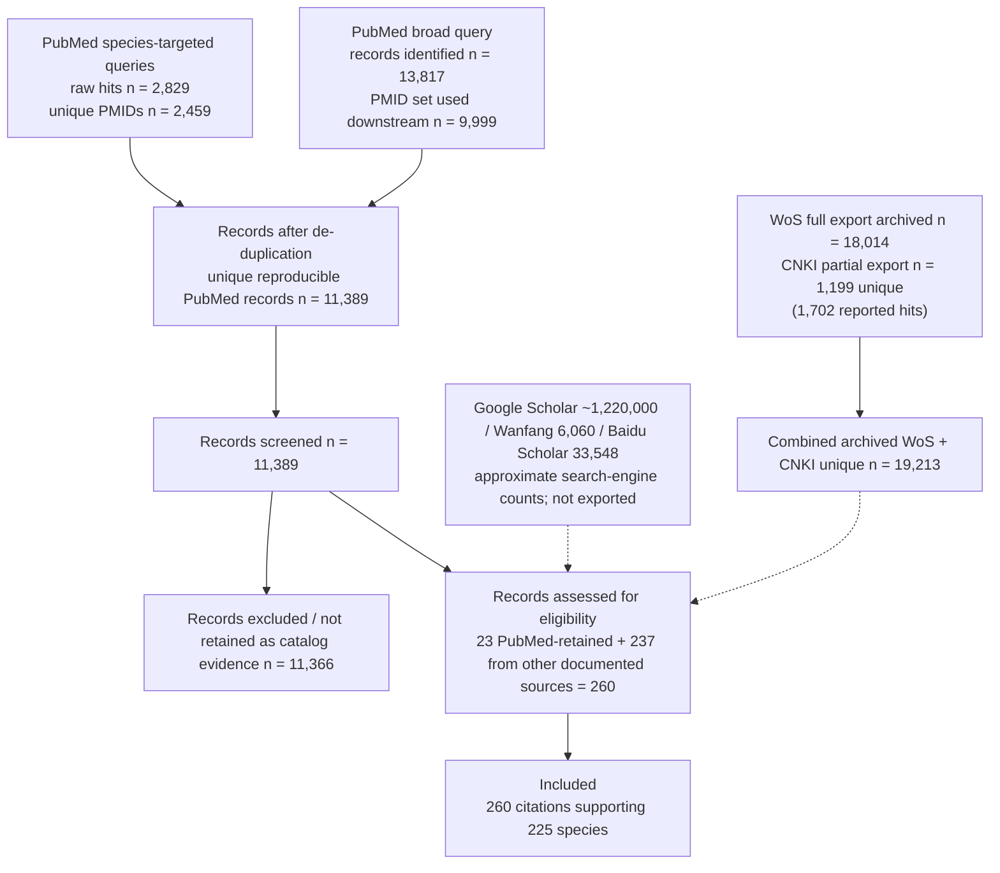

# MaizePathogenDB PRISMA-Style Literature Flow

**Status**: v0.4 (PubMed reproduced 2026-08-25; WoS full export, CNKI partial export, and Google Scholar / Wanfang / Baidu Scholar hit counts archived on 2026-08-26)  
**Freeze**: 2026-08-25  

## 1. Do we need a PRISMA-style flow?

Yes. The current manuscript says the database was built through "systematic
literature mining across PubMed, Web of Science, Google Scholar, CNKI, Baidu
Scholar, and university research group publications" and that candidate
pathogens were "reviewed by three experts". Scientific Data reviewers will
treat those as auditable claims: they will ask for search dates, full query
strings, hit counts, de-duplication, inclusion/exclusion criteria, and
documented expert decisions.

The PubMed arm has been re-run from the manuscript's documented keywords. On
2026-08-26 the WoS Core Collection search was reproduced successfully and the
full 18,014-record export was archived. Five CNKI advanced-search exports were
provided (1,752 raw records, 1,199 unique after de-duplication), but they do
not cover all 1,702 reported CNKI hits. Google Scholar, Wanfang and Baidu
Scholar were reproduced the same day and their hit counts are archived.

## 2. Reproduced PubMed search (2026-08-25)

### Broad query

```text
("Zea mays"[MeSH Terms] OR "Zea mays"[Title/Abstract]
 OR maize[Title/Abstract] OR corn[Title/Abstract]) AND
(pathogen*[Title/Abstract] OR disease*[Title/Abstract]
 OR bacterial[Title/Abstract] OR viral[Title/Abstract]
 OR fungal[Title/Abstract] OR oomyc*[Title/Abstract])
```

- NCBI records identified: 13,817 (exact `count`).
- PMIDs retrievable through JSON ESearch: 9,999 (E-utilities caps `retstart`
  for PubMed at 9,998; the exact record count is still reported).

### Species-targeted queries (225)

For every catalog species:

```text
"<catalog species>"[Title/Abstract] AND
(maize[Title/Abstract] OR corn[Title/Abstract]
 OR "Zea mays"[Title/Abstract])
```

- Total raw hits across 225 queries: 2,829.
- Unique PMIDs after de-duplication: 2,459.
- Additional unique PMIDs not returned by the broad query: 1,390.

### Citation-to-PubMed mapping

- Candidate citations: 260, covering 225 species.
- Citations with a PubMed PMID after DOI/PMID review: 98 (77 unique PMIDs).
- Citations whose PMID was recovered by the species-targeted searches: 33
  rows (27 unique PMIDs).
- Of the 77 unique citation PMIDs, 47 are in the broad-query fetched set and
  27 are in the species-targeted set (16 are in both).
- Citations without a PubMed PMID: 162 (from WoS, CNKI, compendia, and other
  documented sources).

### Web of Science (reproduced 2026-08-26)

```text
TS=(maize OR corn OR "Zea mays")
AND
TS=(disease OR pathogen)
```

- Raw query: 18,014 documents.
- Refined to Article/Review, 2000-2026: 14,145 documents.
- WoS Core Collection, Clarivate (Chinese mirror).
- Full RIS export archived: 18,014 records, 18,014 unique WOS IDs, 15,816
  unique DOIs.
- Catalog overlap: 77 unique citation DOIs in WoS; 96 candidate citation rows
  with a WoS DOI; 108 candidate citation rows and 92 unique WoS records
  matched by DOI or normalized title.

### CNKI (user-supplied count, 2026-08-26)

```text
主题 = 玉米 AND 主题 = 病原
```

- CNKI advanced search raw total: 1,702 documents.
- Five provided ENW exports: 1,752 raw records, 553 duplicates inside/across
  files, 1,199 unique records (397 with DOI, 802 without).
- Coverage gap: 503 of the reported 1,702 hits are absent from the provided
  exports, so this archive is a partial CNKI export.
- Catalog overlap: 15 candidate citation rows and 5 unique CNKI records
  matched (15 species represented in the matched rows).

### Google Scholar / Wanfang / Baidu Scholar (reproduced 2026-08-26)

```text
Google Scholar: maize pathogen; 玉米 病原
Wanfang:       maize pathogen; 玉米 AND 病原
Baidu Scholar: maize pathogen; 玉米 病原
```

- Google Scholar: about 1,220,000 results for `maize pathogen`; about 56,700
  for `玉米 病原` (approximate result counts).
- Wanfang: 2,946 hits for `maize pathogen`; 6,060 hits for
  `玉米 AND 病原`.
- Baidu Scholar: 942 related results for `maize pathogen`; 33,548 related
  results for `玉米 病原`.
- These are search-engine hit counts, not de-duplicated record exports. They
  are archived in `data/literature_search_log.tsv` and are not merged into
  the reproducible screening arithmetic.

## 3. PRISMA flow (reproducible PubMed arm + final evidence set)



WoS (18,014 raw / 14,145 filtered) is recorded as an identification count in
`data/literature_search_log.tsv` and its full export is archived. The CNKI
export is partial: 1,752 raw / 1,199 unique records are archived, while 503 of
the reported 1,702 hits are still missing. The WoS and CNKI exports were
de-duplicated against each other (0 exact DOI/title overlaps), giving 19,213
combined unique exported records. PubMed, WoS, and CNKI together anchor 140 of
the 260 candidate citation rows (136 species) through reproducible
identifiers/titles; the remaining candidate citations come from books,
compendia, and sources that are not fully archived. Machine-readable results:
`data/literature_search/literature_export_analysis.json`.

Google Scholar (~1,220,000 for `maize pathogen`), Wanfang (6,060 for
`玉米 AND 病原`) and Baidu Scholar (33,548 for `玉米 病原`) are recorded as
approximate identification counts. They are not merged into the screening
arithmetic because their record sets were not exported and their "results" are
not de-duplicated.

## 4. Auditable facts currently available (final freeze)

The following numbers are verifiable from the frozen files and may be used in
the flow diagram today:

| Item | Count | Source |
|---|---:|---|
| Catalog species | 225 | `data/species_list.tsv` |
| Bacteria | 21 | `data/species_list.tsv` |
| Viruses | 36 | `data/species_list.tsv` |
| Fungi | 136 | `data/species_list.tsv` |
| Oomycetes | 32 | `data/species_list.tsv` |
| WoS records exported (2026-08-26) | 18,014 | `data/literature_search/wos_export/` |
| CNKI unique records exported (partial) | 1,199 | `data/literature_search/cnki_export/` |
| Google Scholar results (`maize pathogen`) | 1,220,000 | `data/literature_search_log.tsv` |
| Wanfang hits (`玉米 AND 病原`) | 6,060 | `data/literature_search_log.tsv` |
| Baidu Scholar related results (`玉米 病原`) | 33,548 | `data/literature_search_log.tsv` |
| Candidate citation rows anchored by PubMed, WoS, or CNKI | 140 | `data/literature_search/literature_export_analysis.json` |
| Species with raw pathogenicity references | 225 | `data/evidence_audit.tsv` |
| Species with explicit DOI/PMID before assisted normalization | 9 | `data/evidence_audit.tsv` |
| Species with a high-confidence DOI/PMID candidate after assisted normalization | 190 | `data/reference_resolution.tsv` (human review completed) |
| Species with marker sequences / genomes | 201 | `data/species_list.tsv` |
| Species missing sequences | 24 | `data/species_list.tsv` |
| Species with TaxID NOT_VERIFIED | 14 | `data/species_list.tsv` |

## 4.1 Evidence resolution status

### Raw explicit DOI/PMID (`data/evidence_audit.tsv`)

- Total species: 225.
- Species with at least one explicit DOI/PMID in the raw citation block: 9.

| Resolution status | Count |
|---|---:|
| RESOLVED (explicit DOI/PMID in raw block) | 9 |
| UNRESOLVED (no explicit DOI/PMID) | 216 |

### Assisted normalization (`data/reference_resolution.tsv`)

- Candidate citations parsed from raw blocks: 260.
- Species covered by at least one candidate: 225.
- Species with at least one high-confidence candidate (token overlap >= 0.5)
  or an explicit DOI: 190.
- Citations with a Crossref DOI candidate: 260.
- Citations with a PubMed candidate: 15.
- Citation status: 191 `AUTO_CANDIDATE_HIGH`, 60 `AUTO_CANDIDATE_LOW`,
  9 `RESOLVED_DOI_INPUT`.

Every `AUTO_CANDIDATE_*` and `RESOLVED_DOI_INPUT` entry was confirmed by a
human by opening the DOI/PMID before use. The final outcome for the 260
candidates is 207 Correct, 40 Incorrect, and 13 Not found; all rows are
retained in
`data/literature_search/reference_review/260_citations_review.tsv`.

### Remaining audit notes

- Chinese literature without a Crossref DOI needs CNKI/Wanfang lookup or a
  stable Chinese DOI.
- Books and compendia need complete bibliographic records.
- Google Scholar, Wanfang and Baidu Scholar record sets were not exported;
  manuscript wording should describe them as approximate identification
  counts.

## 5. Flow stages

### 5.1 Identification

- PubMed broad query: 13,817 records (2026-08-25).
- PubMed species-targeted queries: 2,829 raw hits, 2,459 unique PMIDs.
- WoS Core Collection: 18,014 raw / 14,145 filtered (Article/Review,
  2000-2026; reproduced 2026-08-26).
- WoS full export archived: 18,014 records / 18,014 unique WOS IDs.
- CNKI advanced search: 1,702 raw (user supplied 2026-08-26); provided
  exports contain 1,752 raw / 1,199 unique records and are partial.
- Google Scholar: about 1,220,000 results (`maize pathogen`), about 56,700
  (`玉米 病原`); reproduced 2026-08-26, approximate counts.
- Wanfang: 6,060 hits (`玉米 AND 病原`), 2,946 (`maize pathogen`); reproduced
  2026-08-26.
- Baidu Scholar: 33,548 related results (`玉米 病原`), 942 (`maize
  pathogen`); reproduced 2026-08-26.
- Compendia: strategy documented in manuscript Methods; source list remains
  `NOT_ARCHIVED`.
- Machine-readable archive: `data/literature_search_log.tsv` and
  `data/literature_search/`.

### 5.2 Screening and de-duplication

- Unique reproducible PubMed records screened: 11,389.
- Records not retained as catalog evidence: 11,366.
- WoS export: 18,014 unique records, 15,816 unique DOIs.
- CNKI export: 1,199 unique records after de-duplication by DOI or
  title+year+journal; 553 duplicate raw records removed.
- WoS x CNKI cross-source de-duplication: 0 exact DOI/title overlaps;
  combined archived unique set = 19,213.
- Google Scholar, Wanfang and Baidu Scholar are recorded as approximate
  identification counts only; no exported record lists are available, so they
  are not included in de-duplication arithmetic.
- Machine-readable de-duplication:
  `data/literature_search/literature_export_analysis.json`.
- Rule: candidate must be a pathogen associated with maize (Zea mays L.) in
  at least one published report, an authoritative compendium, or multiple
  independent studies with consistent disease association.
- Expert curation review record:
  `docs/curation/EXPERT_REVIEW.md`; reviewers assigned by category:
  bacteria Xiaolong Shao, fungi and oomycetes Lingmin Meng, viruses Zihao
  Xia. All 225 catalog species are recorded as Confirmed; review period
  2026-07-20 to 2026-08-14.

### 5.3 Eligibility

- PubMed-screened records retained as catalog evidence: 23; after DOI/PMID
  review, 33 candidate rows have a PMID in the species-targeted set
  (27 unique PMIDs).
- WoS catalog matches: 108 candidate citation rows (92 unique WOS records).
- CNKI catalog matches: 15 candidate citation rows (5 unique CNKI records).
- Candidate citation rows anchored by PubMed, WoS, or CNKI: 140 (136 species).
- Additional candidate citations from other documented sources (WoS, Google
  Scholar, CNKI, Wanfang, Baidu, compendia) not retained by the PubMed arm:
  237.
- Candidate citations assessed for eligibility: 260.
- Records excluded at eligibility: 0.
- Candidate species with an evidence reference: 225/225.
- After assisted normalization, 190/225 species have a high-confidence
  DOI/PMID candidate (see `data/reference_resolution.tsv`); all 260
  candidates were then human-reviewed (207 Correct, 40 Incorrect, 13 Not
  found).
- Species without sequence records: 24/225, each with a documented reason in
  `data/species_list.tsv` (`missing_reason`).

### 5.4 Included

- Species included in MPDB: 225.
- Species with reference sequences: 201.
- Sequences: 6,133 (402 bacterial 16S rRNA + 5,301 fungal/oomycete ITS + 430
  complete virus genomes).
- Candidate citations supporting the catalog: 260.

## 6. Required before the flow can be published

- Original hit counts and query strings are archived for WoS, Google Scholar,
  CNKI, Wanfang, and Baidu Scholar. Google Scholar, Wanfang and Baidu Scholar
  counts are approximate search-engine results without exported record sets.
- CNKI is described as a partial export: 1,199 unique records are archived
  and 503 reported hits are not exported. Full CNKI export is not required;
  CNKI should not be described as fully archived or screened.
- Expert review decision record: complete (225 species Confirmed by the
  assigned reviewers; review period 2026-07-20 to 2026-08-14).
- DOI/PMID review of the 260 candidates is recorded in
  `data/literature_search/reference_review/260_citations_review.tsv`.
- If the search-engine record sets cannot be exported, describe those counts
  as approximate identification counts rather than de-duplicated screening
  results.

## 7. Filled template

- Filled PRISMA 2020 docx:
  `PRISMA_2020_flow_diagram_filled_MPDB.docx` (included in this package).
- Field mapping: Databases = 1,293,141 (PubMed broad 13,817 + WoS 18,014 +
  CNKI 1,702 reported + Google Scholar 1,220,000 approx. + Wanfang 6,060 +
  Baidu Scholar 33,548 approx.); Registers = 2,829 (PubMed species-targeted
  raw); Duplicates removed = 1,992 (PubMed 1,439 + CNKI export duplicates
  553); Removed for other reasons = 4,321 (E-utilities retrieval cap 3,818 +
  CNKI reported hits absent from exports 503); Screened = 11,389; Excluded =
  11,366; left-path assessed = 23; right-path citation searching = 237;
  included = 225 species / 260 citations.

The filled template lists every database source in the identification box and
adds a footnote explaining approximate search-engine counts and the partial
CNKI export. The screening arithmetic below that box keeps the reproducible
PubMed arm as its basis; WoS/CNKI record-level de-duplication and catalog
overlap are in `data/literature_search/literature_export_analysis.json`.
